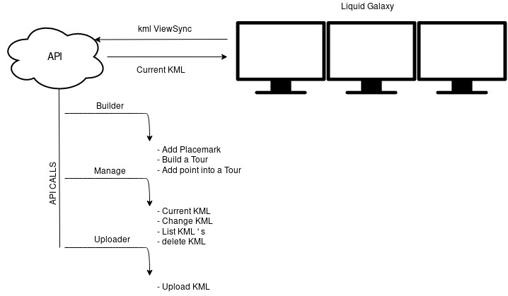

# Liquid Galaxy KML API

> This project it will be developed for the **GSOC 2019** program

> All the **API documentation** and Endpoints you can fint it here:  (in process) **[API documentation](in process)**

## introduction

The system will interact over the liquid galaxy using a KML with a network link.

This KML will do requests to our API. And this one will control which data will be send it to the system.

Here we can see a project scheme:




## Configuration

The project consist an "express Router" object, with all the end points and answerds, with the root path '/kml'. To use the API you will need to say to your express server use the router:

```javascript
const express = require('express')
const app = express()
var kmlAPI = require('kmlAPI')

app.use(kmlAPI)
```

The Api will consume and know which's kml have our system consulting a directory. This directory will be situated in our home, to create this directory just copy the following command in our cli:

```sh
$ mkdir ~/kmlApi
```

Finally you just need to set the IP of your machine into the KML with the network link that you create in the liquid galaxy:

```xml
http://IP/kml/viewsync
```
